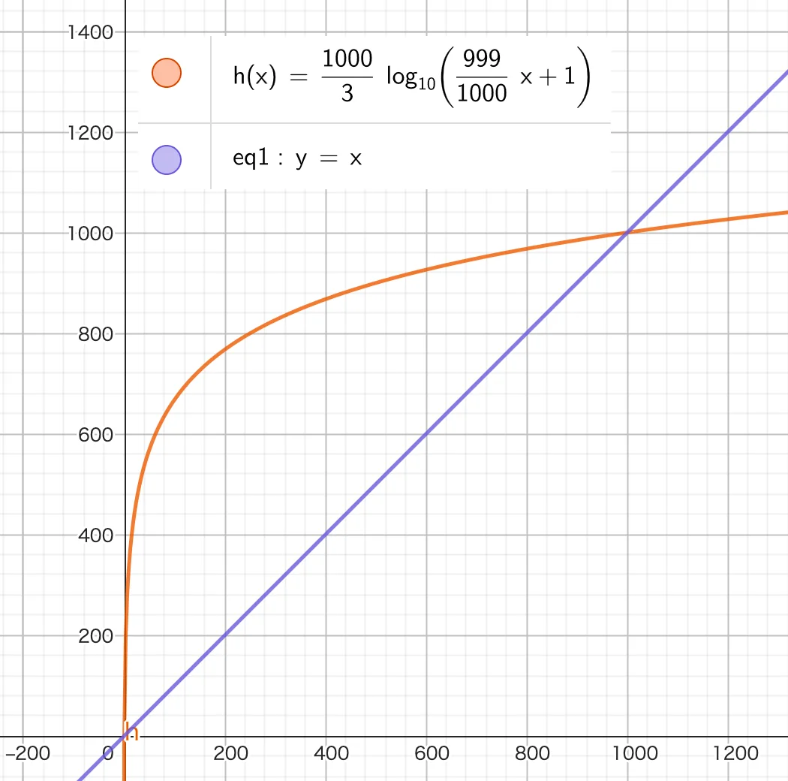

# WPM 表示の対数表示

## 動機

瞬間 WPM を表示すると現状のゲージを飛び出すことがかなり多い．

## 対数表示

### 現状（線形表示）

- ゲージ幅：330px
- 現状の値域：謎（ラベルの数値がおかしい）
  - 実際には 0〜500 で仮実装

### 変更後

- ゲージ幅：330px（同じ）
- 値域：0〜1000
  - それを超えたら天井処理
- 式

  ```
  value = (1000 / 3) * Math.log10((999 / 1000) * wpm + 1);
  ```

  - value: ProgressBar に渡す パラメータ
  - ProgressBar に渡す maxValue は 1000 とする．

### 効果

頻出しそうな 0〜240WPM でゲージの 約 8 割を専有できる．


## UI 更新

以下の値に合わせてゲージのラベルを更新する必要がある．
| WPM | ゲージ上での値 |
| ---- | ---- |
| 0 | 0 |
| 50 | 569 |
| 100 | 668 |
| 150 | 726.2 |
| 200 | 767.6 |
| 250 | 799.7 |
| 300 | 826 |
| 350 | 848.3 |
| 400 | 867.6 |
| 450 | 884.6 |
| 500 | 899.8 |
| 550 | 913.6 |
| 600 | 926.1 |
| 650 | 937.7 |
| 700 | 948.4 |
| 750 | 958.4 |
| 800 | 967.7 |
| 850 | 976.5 |
| 900 | 984.8 |
| 950 | 992.6 |
| 1000 | 1000 |

Excel 用計算式

```
=(1000 / 3) * LOG10((999 / 1000) * A2 + 1)
```

## その他

### 対数化に使った関数の導出

#### 記号定義

$\log$ の底は 10 とする（常用対数）． <br>
$w \in [0, 1000]$ : WPM の値 <br>
$v\in [0, 1000]$ : ProgressBar 上での値 <br>
$v=f(w)$として

- $v$ が $\log w$ に比例する
- $[0, 1000] \rightarrow [0, 1000]$

の 2 つを満たす $f$ を作る．

$\log 0 : undefined$ なので $f(1000)$ を先に考える．<br>
仮に<br>
$g(x) := a\log (x)$ ( $a$ : 任意定数, ただし $a\neq 0$ )<br>
とすると，<br>
$g(1000) = 1000$ から<br>
$g(1000)=a\log 1000 = 3a$ <br>
$\therefore a = \frac{1000}{3}$ <br>
つぎに $f(0)$ について考える． <br>
ここで， $x:=h(w)$ とし， $f(x)=g(h(w))$ とすれば，<br>
$h(0) = 1, h(1000)=1000$ を満たすとき <be>
$f(0) = 0, f(1000)=1000$ を満たす． <br>
$w\in[0,1000]$ を線形変換して $x\in[1,1000]$ にすることを考えると <br>
$x=h(w)=\frac{999}{1000}x+1$ <br>
$\therefore f(w) = \frac{1000}{3}\log (\frac{999}{1000}x+1)$

### 採用しなかった対処

現状のゲージを飛び出すときは，飛び出さないように（max 関数使うなりして）天井処理．

#### 採用しなかった理由

現状のゲージを飛び出す頻度が高すぎる and 切り捨てられる値域が広い．
